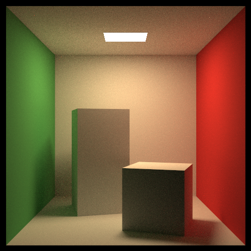
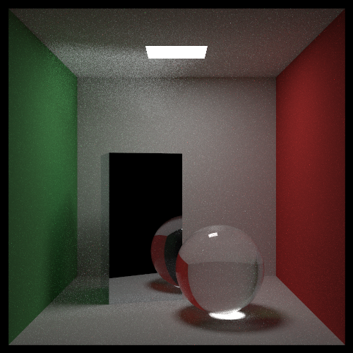

# Path Tracing in One Weekend

## Features
#### 1) Materials
- Lambertian
- Metal
- Dielectric
- Volume

#### 2) Textures
- Constant
- Checker
- Image
- Perlin noise
- Turbulence

#### 3) Camera Effects
- Motion blur
- Defocus blur

#### 4) Monte Carlo and Importance Sampling
- Cosine sampling for diffuse surface
- Direct light sampling
- Metal surface
- Glass sphere

## Environment
Implementation was done in MacOS Catalina.

## Building
#### 1) Open Terminal and go to the project directory.
#### 2) Then go to the src directory:
```
cd src
```
#### 3) Finally compile:
```
g++ -std=c++11 main.cpp -o main
```

## Usage
#### 1) In the src directory, execute:
```
./main
```
#### 2) The rendered image will be stored in the rendered_img folder.

## Sample Rendering Results
#### 1) Cornell Box (1000 samples/px)

#### 2) Metal and Glass (1000 samples/px)

#### 3) Textures (1000 samples/px)


## Library
1) [stb for texture image loader](https://github.com/nothings/stb)

## References
1) [Ray Tracing in One Weekend](https://raytracing.github.io/books/RayTracingInOneWeekend.html)
2) [Ray Tracing: The Next Week](https://raytracing.github.io/books/RayTracingTheNextWeek.html)
3) [Ray Tracing: The Rest of Your Life](https://raytracing.github.io/books/RayTracingTheRestOfYourLife.html)
4) [The Rendering Equation (SIGGRAPH 1986)](http://www.cse.chalmers.se/edu/year/2011/course/TDA361/2007/rend_eq.pdf)
5) [State of the Art in Monte Carlo Ray Tracing for Realistic Image Synthesis (SIGGRAPH 2001 Course)](http://cseweb.ucsd.edu/~viscomp/classes/cse274/fa18/readings/course29sig01.pdf)
